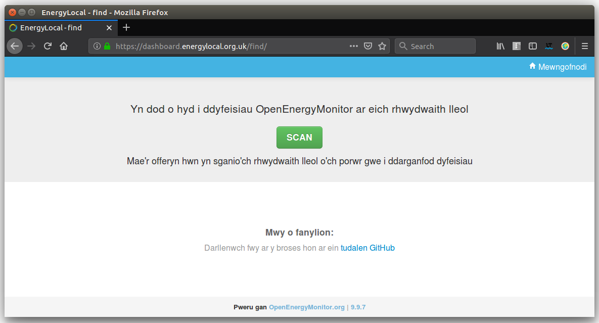
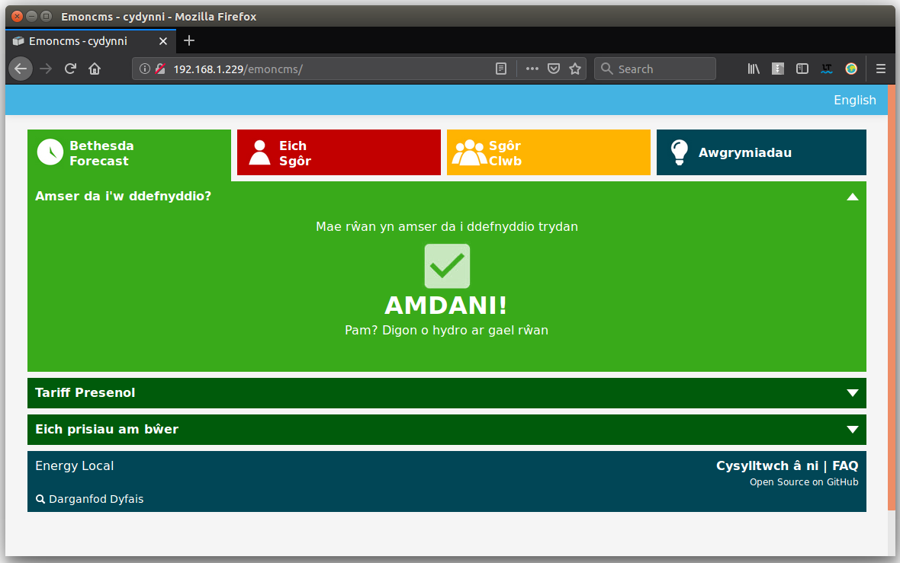
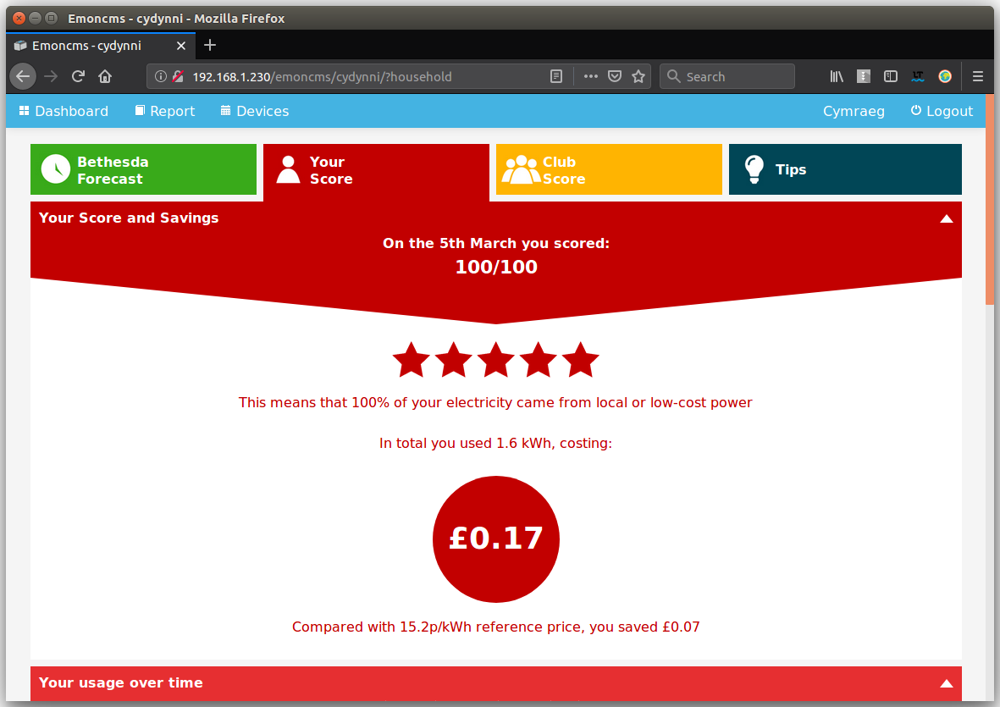

## Setup Guide

### Ethernet Setup

If you have the option to connect your hub directly via Ethernet this is usually easier and more reliable than using WIFI, alternatively if you wish to setup using the WIFI hotspot, skip this section and continue to WIFI Setup below.

Power up the hub by connecting the micro USB cable and USB power supply. Plug in an Ethernet cable to link your hub to your internet router.

### WIFI Setup

#### 1. Power up the CydYnni hub

After a short while a WIFI Access Point should appear called 'EmonPi'. Connect to this network, open an internet browser and enter the following address:

    http://192.168.42.1

#### 2. Connect to WIFI network

Once the page at the address above loads it will give the following options, or if the hub is connected with an ethernet cable there will also be the option to connect over ethernet.

Select 'Connect to WIFI network' to connect to your home WIFI network.
    

The hub will now show a list of available WIFI networks, select the WIFI network you wish to connect to:

Enter the WIFI network passkey if applicable:

After clicking connect the following message is shown. Your hub is now rebooting and will then attempt to connect to the network selected.

### Navigate to the 'Find Devices' tool on the EnergyLocal App:

#### [https://dashboard.energylocal.org.uk/find](https://dashboard.energylocal.org.uk/find)

Click SCAN to find your hub:

Click on the hub (listed as emonbase) to open it in your browser.

You will now be greeted with the EnergyLocal Hub dashboard page.

**Troubleshooting**

If the hub does not appear the first time, try refreshing the page a couple of times.

If this does not work try navigating to your hub directly with the following links

[http://emonpi.local](http://emonpi.local)
    
or:

[http://emonpi](http://emonpi)
 
Or alternatively check your routers device list or use a mobile app called 'fing' to scan your network to find the hub.

---

Enter your CydYnni username and password.

### 4. Explore your hub dashboard

The first page presents the CydYnni forecast showing when it's a good time to use electricity or not and the recent history of club consumption and generator output.

The second page shows your score, which relates to how well you're managing to match your use to local electricity and cheap times for extra electricity.

The 3rd page shows the club score and overview.

The 4rth tab shows a list of devices.

### 5. Setting up your WiFi Smart Plug

The Smart Plug will allow you to schedule whatever is plugged into it to come on and go off for periods of time that you set and is connected to the Forecast facility. This allows you to automatically use electricity at the best times.

1\. Plug your smart plug into an electrical socket. The light on the plug will show green for 3 seconds followed by a short off period and then a couple of very short flashes. This indicates that the plug is working and has created a WIFI Access Point.

2\. The WIFI Access Point should appear in your laptop or phones available WIFI networks, the SSID will contain the name smartplug followed by a number e.g: 'smartplug1'.

3\. Connect to this network, open an internet browser and enter the following address:

**[http://192.168.4.1](http://192.168.4.1)**
    

4\. Select the WIFI network you wish to connect to, enter the passkey and click connect. 

The green light on the smartplug will now turn on again. If the connection is successful you will see 10 very fast consecutive flashes. 

5\. The web interface will also show that the module has connected and its IP address:

**Failed Connection**

If the smartplug fails to connect to the selected WIFI network the green LED will stay on with a slight pulsing rythym for 30 seconds before the plug automatically resets and tries again. To re-enter setup mode hold the button on the front of the smartplug down while the green LED is on.

---

6\. Connect back to you home network and navigate to the devices page, after a couple of minutes a notice will appear asking whether to allow device at the given ip address to connect:

7\. Click allow. Refresh the device interface until the smartplug device appears.

8\. Clicking on the smartplug device will bring up the scheduler interface:

